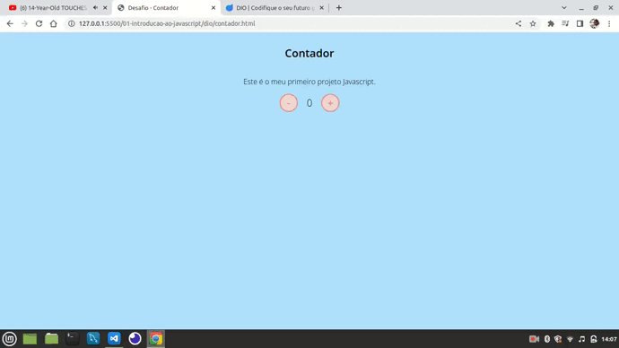

# Introdução ao JavaScript

**javascript**: JavaScript é uma linguagem de programação interpretada estruturada, de script em alto nível com tipagem dinâmica fraca e multiparadigma. Juntamente com HTML e CSS, o JavaScript é uma das três principais tecnologias da World Wide Web.

#### Organização - Aula

- [x] O que é JavaScript?
  - [x] Apresentação do curso
  - [x] História, Evolução e Aplicações  
- [x] Recursos básicos de linguagem
  - [x] Manipulando um arquivo
  - [x] Funções 
- [x] Console
  - [x] Executando um arquivo.js
- [x] JavaScript em uma página da web
  - [x] Estrutura de projeto
  - [x] Inserindo javaScript numa página HTML
  - [x] Interagindo com os elementos do DOM
- [x] Colocando em prática
  - [x] Criando um contador
  - [x] Desafio: To-do list
- [x] Mercado de Trabalho
  - [x] Frameworks
  - [x] Mercado de trabalho 

#### O que foi desenvolvido?

- [x] Contador
  - [x] Desafio 1.1 - stebsnusch (addEventListener)
  - [x] Desafio 1.2 - stebsnusch (0 <= count =< 10)
  - [x] Desafio 1.3 - stebsnusch (Vermelho (-) e Verde (+) ) 
- [x] Todo List

